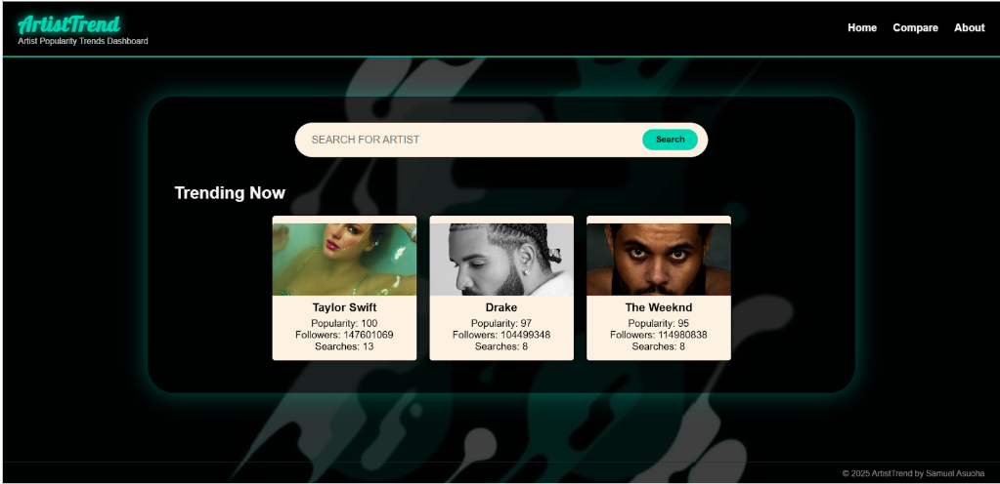
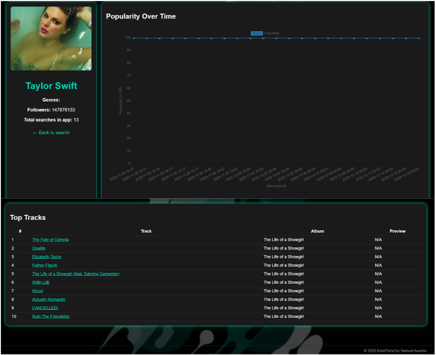

# ArtistTrend – Artist Popularity Trends Dashboard

ArtistTrend is a Django web application that uses the Spotify Web API to analyse and visualise the popularity of music artists.  
It allows users to search for artists, compare popularity metrics, and track trends over time using real Spotify data.

---

## Features

- Search for artists and view their current popularity, followers, genres, and images
- Store artist data and popularity history in a database
- Display trending artists based on Spotify metrics and user search behaviour
- Compare two artists side-by-side by popularity and followers
- Visualize popularity and follower data using Chart.js
- Artist detail pages with historical popularity tracking
- Simple navigation with Home, Compare, and About pages

---

## Screenshots

### Home – Trending Artists

### Compare Artists

### Artist Detail Page

---

## Technologies Used

- **Backend:** Django (Python)
- **Database:** SQLite (via Django ORM)
- **External API:** Spotify Web API (Client Credentials Flow)
- **Charts:** Chart.js (via CDN)
- **Frontend:** HTML, CSS, JavaScript
- **Automation:** Django management commands, Windows Task Scheduler

---

## Setup Instructions

### 1. Clone the repository

git clone https://github.com/yourusername/ArtistTrend.git
cd ArtistTrend

### 2. Create and activate a virtual environment

python -m venv venv
venv\Scripts\activate

### 3. Install dependencies

pip install -r requirements.txt

### 4. Configure Spotify API credentials

SPOTIFY_CLIENT_ID=your_client_id_here
SPOTIFY_CLIENT_SECRET=your_client_secret_here

### 5. Run database migrations

python manage.py migrate

### 6. Start the development server

python manage.py runserver

## Automated Data Updates

Artist popularity data is refreshed daily using:
- A custom Django management command (update_artist_popularity)
- A Windows .bat script
- Windows Task Scheduler
This ensures popularity history is updated automatically over time.

## Limitations

- SQLite is used for development and is not optimised for high traffic
- Popularity history is snapshot-based rather than continuous real-time tracking
- User authentication and personalisation are not implemented

## Future Improvements

- Migrate to PostgreSQL for production use
- Add user accounts and favourite artists
- Implement long-term popularity trend line charts
- Deploy using Docker or a cloud platform
- Add genre-based analytics and dashboards

## Author

Samuel Asuoha
ArtistTrend – Academic Full-Stack Project 